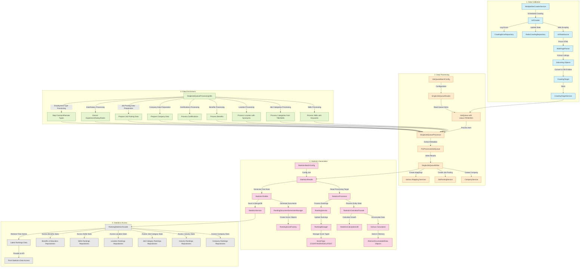

# 프로젝트 구성도


# 프로젝트 구조

```
├── main
│   ├── kotlin
│   │   └── com
│   │       └── example
│   │           └── jobstat
│   │               ├── auth
│   │               │   ├── email
│   │               │   │   ├── entity
│   │               │   │   ├── repository
│   │               │   │   ├── service
│   │               │   │   └── usecase
│   │               │   ├── token
│   │               │   │   ├── service
│   │               │   │   └── usecase
│   │               │   └── user
│   │               │       ├── entity
│   │               │       ├── repository
│   │               │       ├── service
│   │               │       └── usecase
│   │               ├── community
│   │               │   ├── board
│   │               │   │   ├── entity
│   │               │   │   ├── model
│   │               │   │   ├── repository
│   │               │   │   ├── service
│   │               │   │   └── usecase
│   │               │   └── comment
│   │               │       ├── entity
│   │               │       ├── repository
│   │               │       ├── service
│   │               │       └── usecase
│   │               ├── core
│   │               │   ├── base
│   │               │   │   ├── mongo
│   │               │   │   │   ├── ranking
│   │               │   │   │   └── stats
│   │               │   │   └── repository
│   │               │   ├── config
│   │               │   ├── constants
│   │               │   ├── converter
│   │               │   ├── error
│   │               │   ├── extension
│   │               │   ├── security
│   │               │   │   └── annotation
│   │               │   ├── state
│   │               │   ├── usecase
│   │               │   │   └── impl
│   │               │   ├── utils
│   │               │   └── wrapper
│   │               └── statistics
│   │                   ├── rankings
│   │                   │   ├── document
│   │                   │   ├── model
│   │                   │   │   └── rankingtype
│   │                   │   ├── repository
│   │                   │   ├── service
│   │                   │   └── usecase
│   │                   │       └── analyze
│   │                   └── stats
│   │                       ├── document
│   │                       ├── registry
│   │                       ├── repository
│   │                       ├── service
│   │                       └── usecase
│   └── resources
│       └── static
└── test
    └── kotlin
        └── com
            └── example
                └── jobstat
                    ├── auth
                    │   ├── token
                    │   │   └── service
                    │   └── user
                    │       ├── fake
                    │       ├── repository
                    │       ├── service
                    │       └── usecase
                    ├── community
                    │   ├── fake
                    │   │   └── repository
                    │   ├── repository
                    │   ├── service
                    │   └── usecase
                    ├── core
                    │   └── base
                    │       └── repository
                    ├── rankings
                    │   ├── fake
                    │   └── service
                    ├── statistics
                    │   ├── fake
                    │   └── stats
                    │       ├── fake
                    │       └── service
                    └── utils
                        ├── base
                        ├── config
                        └── dummy
```

# 테스트 커버리지


# 필수 환경변수

애플리케이션이 정상적으로 구동되기 위해 아래 환경변수들을 설정해야 합니다. 각 변수의 값은 본인의 실제 환경에 맞게 입력해 주세요.

- **DB_PASSWORD**: `<YOUR_DB_PASSWORD>`
- **MONGO_USERNAME**: `<YOUR_MONGO_USERNAME>`
- **MONGO_PASSWORD**: `<YOUR_MONGO_PASSWORD>`
- **SENTRY_DSN**: `<YOUR_SENTRY_DSN>`
- **SENTRY_AUTH_TOKEN**: `<YOUR_SENTRY_AUTH_TOKEN>`
- **JWT_SECRET**: `<YOUR_JWT_SECRET>`
- **DB_HOST**: `<YOUR_DB_HOST>`
- **MONGO_HOST**: `<YOUR_MONGO_HOST>`
- **REDIS_HOST**: `<YOUR_REDIS_HOST>`
- **CORS_ALLOWED_ORIGINS**: `<YOUR_CORS_ALLOWED_ORIGINS>`
- **DB_USERNAME**: `<YOUR_DB_USERNAME>`
- **DDNS_DOMAIN**: `<YOUR_DDNS_DOMAIN>`
- **GMAIL_PASSWORD**: `<YOUR_GMAIL_PASSWORD>`
- **GMAIL_ID**: `<YOUR_GMAIL_ID>`
- **ADMIN_USERNAME**: `<YOUR_ADMIN_USERNAME>`
- **ADMIN_PASSWORD**: `<YOUR_ADMIN_PASSWORD>`
- **REDIS_PASSWORD**: `<YOUR_REDIS_PASSWORD>`
- **REDIS_USERNAME**: `<YOUR_REDIS_USERNAME>`

# Mysql 테이블


# Mongo 도큐먼트 구조

### Stats 도큐먼트
```mermaid
classDiagram
    %% [1] 기본/공통 클래스 및 인터페이스
    class BaseDocument {
      +id: String?
    }
    class BaseTimeSeriesDocument {
      +baseDate: String
      +period: SnapshotPeriod
    }
    BaseDocument <|-- BaseTimeSeriesDocument


    class SnapshotPeriod {
      +startDate: Instant
      +endDate: Instant
      +durationInDays: Long
    }

    class RankingInfo {
      <<interface>>
      +currentRank: int
      +previousRank: Integer?
      +rankChange: Integer?
      +percentile: Double?
      +rankingScore: RankingScore
    }
    class RankingScore {
      <<interface>>
      +value: double
    }
    class PostingCountScore {
      +value: double
      +totalPostings: int
      +activePostings: int
    }
    RankingScore <|-- PostingCountScore

    class BaseStats {
      <<interface>>
      +postingCount: int
      +activePostingCount: int
      +avgSalary: long
      +growthRate: double
      +yearOverYearGrowth: Double?
      +monthOverMonthChange: Double?
      +demandTrend: String
    }
    class CommonStats {
      +postingCount: int
      +activePostingCount: int
      +avgSalary: long
      +growthRate: double
      +yearOverYearGrowth: Double?
      +monthOverMonthChange: Double?
      +demandTrend: String
    }
    BaseStats <|-- CommonStats

    class Distribution {
      <<interface>>
      +count: int
      +ratio: double
      +avgSalary: Long?
    }
    class CommonDistribution {
      +count: int
      +ratio: double
      +avgSalary: Long?
    }
    Distribution <|-- CommonDistribution

    %% [3] 통계(Stats) 도큐먼트 베이스 및 기존 구현
    class BaseStatsDocument {
      +entityId: Long
      +stats: BaseStats
      +rankings: Map~RankingType,RankingInfo~
    }
    BaseTimeSeriesDocument <|-- BaseStatsDocument

    class BenefitStatsDocument {
      +entityId: Long
      +baseDate: String
      +period: SnapshotPeriod
      +name: String
      +stats: BenefitStats
      +industryDistribution: List~BenefitIndustry~
      +jobCategoryDistribution: List~BenefitJobCategory~
      +companySizeDistribution: List~BenefitCompanySize~
      +locationDistribution: List~BenefitLocation~
      +experienceDistribution: List~BenefitExperience~
      +compensationImpact: BenefitCompensationImpact
      +employeeSatisfaction: BenefitSatisfactionMetrics
      +costMetrics: BenefitCostMetrics
      +rankings: Map~RankingType,BenefitRankingInfo~
    }
    BaseStatsDocument <|-- BenefitStatsDocument

    class CertificationStatsDocument {
      +entityId: Long
      +baseDate: String
      +period: SnapshotPeriod
      +name: String
      +stats: CertificationStats
      +jobCategoryDistribution: List~CertificationJobCategory~
      +industryDistribution: List~CertificationIndustry~
      +skillCorrelations: List~CertificationSkill~
      +experienceDistribution: List~CertificationExperience~
      +companyDistribution: List~CertificationCompany~
      +locationDistribution: List~CertificationLocation~
      +examMetrics: CertificationExamMetrics
      +careerImpact: CertificationCareerImpact
      +investmentMetrics: CertificationInvestmentMetrics
      +rankings: Map~RankingType,CertificationRankingInfo~
      +type: String
    }
    BaseStatsDocument <|-- CertificationStatsDocument

    class CompanyStatsDocument {
      +entityId: Long
      +baseDate: String
      +period: SnapshotPeriod
      +name: String
      +stats: CompanyStats
      +size: CompanySize
      +industryId: Long
      +jobCategories: List~CompanyJobCategory~
      +skills: List~CompanySkill~
      +benefits: List~CompanyBenefit~
      +experienceDistribution: List~CompanyExperienceDistribution~
      +educationDistribution: List~CompanyEducationDistribution~
      +locationDistribution: List~CompanyLocationDistribution~
      +hiringTrends: CompanyHiringTrends
      +remoteWorkRatio: double
      +contractTypeDistribution: List~ContractTypeDistribution~
      +employeeSatisfaction: CompanyEmployeeSatisfaction
      +rankings: Map~RankingType,CompanyRankingInfo~
    }
    BaseStatsDocument <|-- CompanyStatsDocument

    class ContractTypeStatsDocument {
      +entityId: Long
      +baseDate: String
      +period: SnapshotPeriod
      +type: String
      +stats: ContractTypeStats
      +industryDistribution: List~ContractTypeIndustry~
      +jobCategoryDistribution: List~ContractTypeJobCategory~
      +companySizeDistribution: List~ContractTypeCompanySize~
      +locationDistribution: List~ContractTypeLocation~
      +experienceDistribution: List~ContractTypeExperience~
      +skillDistribution: List~ContractTypeSkill~
      +compensationMetrics: ContractTypeCompensation
      +employmentMetrics: ContractTypeEmployment
      +conversionMetrics: ContractTypeConversion
      +rankings: Map~RankingType,ContractTypeRankingInfo~
    }
    BaseStatsDocument <|-- ContractTypeStatsDocument

    class EducationStatsDocument {
      +entityId: Long
      +baseDate: String
      +period: SnapshotPeriod
      +level: String
      +stats: EducationStats
      +industryDistribution: List~EducationIndustry~
      +jobCategoryDistribution: List~EducationJobCategory~
      +companySizeDistribution: List~EducationCompanySize~
      +locationDistribution: List~EducationLocation~
      +skillRequirements: List~EducationSkill~
      +careerMetrics: EducationCareerMetrics
      +roiMetrics: EducationRoiMetrics
      +marketDemand: EducationMarketDemand
      +rankings: Map~RankingType,EducationRankingInfo~
    }
    BaseStatsDocument <|-- EducationStatsDocument

    %% [4] 추가 통계(Stats) 구현 도큐먼트
    class ExperienceStatsDocument {
      +entityId: Long
      +baseDate: String
      +period: SnapshotPeriod
      +range: String
      +stats: ExperienceStats
      +industryDistribution: List~ExperienceIndustry~
      +jobCategoryDistribution: List~ExperienceJobCategory~
      +companySizeDistribution: List~ExperienceCompanySize~
      +locationDistribution: List~ExperienceLocation~
      +skillRequirements: List~ExperienceSkill~
      +careerProgression: ExperienceCareerProgression
      +salaryMetrics: ExperienceSalaryMetrics
      +marketValue: ExperienceMarketValue
      +employmentTypeDistribution: List~ExperienceEmploymentType~
      +rankings: Map~RankingType,ExperienceRankingInfo~
    }
    BaseStatsDocument <|-- ExperienceStatsDocument

    class LocationStatsDocument {
      +entityId: Long
      +baseDate: String
      +period: SnapshotPeriod
      +name: String
      +stats: LocationStats
      +industryDistribution: List~LocationIndustry~
      +jobCategoryDistribution: List~LocationJobCategory~
      +companyDistribution: List~LocationCompany~
      +skillDistribution: List~LocationSkill~
      +experienceDistribution: List~LocationExperience~
      +educationDistribution: List~LocationEducation~
      +employmentMetrics: LocationEmploymentMetrics
      +livingMetrics: LocationLivingMetrics
      +remoteWorkStats: LocationRemoteWorkStats
      +rankings: Map~RankingType,LocationRankingInfo~
    }
    BaseStatsDocument <|-- LocationStatsDocument

    class RemoteWorkStatsDocument {
      +entityId: Long
      +baseDate: String
      +period: SnapshotPeriod
      +type: String
      +stats: RemoteWorkStats
      +industryDistribution: List~RemoteWorkIndustry~
      +jobCategoryDistribution: List~RemoteWorkJobCategory~
      +companySizeDistribution: List~RemoteWorkCompanySize~
      +locationDistribution: List~RemoteWorkLocation~
      +skillDistribution: List~RemoteWorkSkill~
      +experienceDistribution: List~RemoteWorkExperience~
      +productivityMetrics: RemoteWorkProductivity
      +collaborationMetrics: RemoteWorkCollaboration
      +infrastructureMetrics: RemoteWorkInfrastructure
      +satisfactionMetrics: RemoteWorkSatisfaction
      +rankings: Map~RankingType,RemoteWorkRankingInfo~
    }
    BaseStatsDocument <|-- RemoteWorkStatsDocument

    class IndustryStatsDocument {
      +entityId: Long
      +baseDate: String
      +period: SnapshotPeriod
      +name: String
      +stats: IndustryStats
      +jobCategories: List~IndustryJobCategory~
      +skills: List~IndustrySkill~
      +companies: List~IndustryCompany~
      +experienceDistribution: List~ExperienceDistribution~
      +educationDistribution: List~EducationDistribution~
      +locationDistribution: List~LocationDistribution~
      +salaryRangeDistribution: List~SalaryRangeDistribution~
      +companySizeDistribution: List~CompanySizeDistribution~
      +remoteWorkRatio: Double
      +contractTypeDistribution: List~ContractTypeDistribution~
      +rankings: Map~RankingType,IndustryRankingInfo~
    }
    BaseStatsDocument <|-- IndustryStatsDocument

    class JobCategoryStatsDocument {
      +entityId: Long
      +baseDate: String
      +period: SnapshotPeriod
      +name: String
      +stats: JobCategoryStats
      +skills: List~JobCategorySkill~
      +certifications: List~JobCategoryCertification~
      +experienceDistribution: List~ExperienceDistribution~
      +educationDistribution: List~EducationDistribution~
      +salaryRangeDistribution: List~SalaryRangeDistribution~
      +companySizeDistribution: List~CompanySizeDistribution~
      +industryDistribution: List~IndustryDistribution~
      +locationDistribution: List~LocationDistribution~
      +benefitsDistribution: List~BenefitDistribution~
      +remoteWorkRatio: Double
      +contractTypeDistribution: List~ContractTypeDistribution~
      +transitionPaths: List~CareerTransitionPath~
      +rankings: Map~RankingType,JobCategoryRankingInfo~
    }
    BaseStatsDocument <|-- JobCategoryStatsDocument

    class SkillStatsDocument {
      +entityId: Long
      +baseDate: String
      +period: SnapshotPeriod
      +name: String
      +stats: SkillStats
      +experienceLevels: List~SkillExperienceLevel~
      +companySizeDistribution: List~CompanySizeDistribution~
      +industryDistribution: List~IndustryDistribution~
      +isSoftSkill: Boolean
      +isEmergingSkill: Boolean
      +relatedJobCategories: List~RelatedJobCategory~
      +rankings: Map~RankingType,SkillRankingInfo~
    }
    BaseStatsDocument <|-- SkillStatsDocument
```

### Ranking 도큐먼트

### Mongo Repository 상속구조

```mermaid
classDiagram
    %% 인터페이스 정의
    class MongoRepository {
        <<interface>>
    }
    class BaseMongoRepository {
        <<interface>>
        +findByCreatedAtBetween(start, end)
        +findAllByQuery(query)
        +bulkFindByIds(ids)
        +bulkInsert(entities)
        +bulkUpdate(entities)
        +bulkDelete(ids)
        +bulkUpsert(entities)
    }
    class BaseTimeSeriesRepository {
        <<interface>>
        +findByBaseDate(baseDate)
        +findByBaseDateBetween(startDate, endDate)
        +findLatest()
        +findLatestN(n)
    }
    class BaseRankingRepository {
        <<interface>>
        +findByPage(baseDate, page)
        +findAllPages(baseDate)
        +findTopN(baseDate, limit)
        +findByRankRange(baseDate, startRank, endRank)
        +findByEntityId(baseDate, entityId)
        +findTopMovers(startDate, endDate, limit)
        +findTopLosers(startDate, endDate, limit)
        +findStableEntities(months, maxRankChange)
        +findVolatileEntities(months, minRankChange)
        +findEntitiesWithConsistentRanking(months, maxRank)
    }
    class SimpleRankingRepository {
        <<interface>>
        +findByValueRange(baseDate, minValue, maxValue)
        +findRisingStars(months, minRankImprovement)
        +findByEntityIdAndBaseDate(entityId, baseDate)
    }
    class RelationshipRankingRepository {
        <<interface>>
        +findByPrimaryEntityId(primaryEntityId, baseDate)
        +findTopNRelatedEntities(primaryEntityId, baseDate, limit)
        +findByRelatedEntityId(relatedEntityId, baseDate)
        +findStrongRelationships(baseDate, minScore)
        +findStrongestPairs(baseDate, limit)
        +findCommonRelationships(primaryEntityId1, primaryEntityId2, baseDate)
    }
    class DistributionRankingRepository {
        <<interface>>
        +findByDistributionPattern(baseDate, pattern, threshold)
        +findByDominantCategory(baseDate, category)
        +findDistributionTrends(entityId, months)
        +findSignificantDistributionChanges(startDate, endDate)
        +findSimilarDistributions(entityId, baseDate, similarity)
        +findUniformDistributions(baseDate, maxVariance)
        +findSkewedDistributions(baseDate, minSkewness)
        +findDistributionChanges(entityId, months)
        +findCategoryDominance(baseDate, category, minPercentage)
    }
    class ReferenceMongoRepository {
        <<interface>>
        +findByReferenceId(referenceId)
        +findByReferenceIds(referenceIds)
        +findByEntityType(entityType)
        +findByEntityTypeAndStatus(entityType, status)
        +findByReferenceIdAndEntityType(referenceId, entityType)
        +updateStatus(referenceId, status)
    }
    class StatsMongoRepository {
        <<interface>>
        +getCollectionName()
        +findByEntityId(entityId)
        +findByEntityIdAndBaseDate(entityId, baseDate)
        +findByBaseDateAndEntityIds(baseDate, entityIds)
        +findStatsByEntityIdsBatch(baseDate, entityIds, batchSize)
        +findByBaseDateBetweenAndEntityId(startDate, endDate, entityId)
        +findLatestStatsByEntityId(entityId)
        +findTopGrowthSkills(startDate, endDate, limit)
        +findTopSkillsByIndustry(industryId, baseDate, limit)
        +findTopSkillsByCompanySize(companySize, baseDate, limit)
        +findTopSkillsByJobCategory(jobCategoryId, baseDate, limit)
        +findEmergingSkillsByIndustry(industryId, baseDate, minGrowthRate)
        +findSkillsWithMultiIndustryGrowth(baseDate, minIndustryCount, minGrowthRate)
    }

    %% 구현 클래스 정의
    class SimpleMongoRepository {
        <<abstract>>
    }
    class BaseMongoRepositoryImpl {
        <<abstract>>
        -OPTIMAL_BATCH_SIZE: int
        -UNORDERED_BULK_OPTIONS: BulkWriteOptions
        +findByCreatedAtBetween(start, end)
        +findAllByQuery(query)
        +bulkFindByIds(ids)
        +bulkInsert(entities)
        +bulkUpdate(entities)
        +bulkDelete(ids)
        +bulkUpsert(entities)
        -queryToFilter(query)
        -queryToSort(query)
    }
    class BaseTimeSeriesRepositoryImpl {
        <<abstract>>
        +findByBaseDate(baseDate)
        +findByBaseDateBetween(startDate, endDate)
        +findLatest()
        +findLatestN(n)
    }
    class BaseRankingRepositoryImpl {
        <<abstract>>
        +findByPage(baseDate, page)
        +findAllPages(baseDate)
        +findTopN(baseDate, limit)
        +findByRankRange(baseDate, startRank, endRank)
        +findByEntityId(baseDate, entityId)
        +findTopMovers(startDate, endDate, limit)
        +findTopLosers(startDate, endDate, limit)
        +findStableEntities(months, maxRankChange)
        +findVolatileEntities(months, minRankChange)
        +findEntitiesWithConsistentRanking(months, maxRank)
    }
    class SimpleRankingRepositoryImpl {
        <<abstract>>
        +findByValueRange(baseDate, minValue, maxValue)
        +findRisingStars(months, minRankImprovement)
        +findByEntityIdAndBaseDate(entityId, baseDate)
    }
    class RelationshipRankingRepositoryImpl {
        <<abstract>>
        +findByPrimaryEntityId(primaryEntityId, baseDate)
        +findTopNRelatedEntities(primaryEntityId, baseDate, limit)
        +findByRelatedEntityId(relatedEntityId, baseDate)
        +findStrongRelationships(baseDate, minScore)
        +findStrongestPairs(baseDate, limit)
        +findCommonRelationships(primaryEntityId1, primaryEntityId2, baseDate)
    }
    class DistributionRankingRepositoryImpl {
        <<abstract>>
        +findByDistributionPattern(baseDate, pattern, threshold)
        +findByDominantCategory(baseDate, category)
        +findDistributionTrends(entityId, months)
        +findSignificantDistributionChanges(startDate, endDate)
        +findSimilarDistributions(entityId, baseDate, similarity)
        +findUniformDistributions(baseDate, maxVariance)
        +findSkewedDistributions(baseDate, minSkewness)
        +findDistributionChanges(entityId, months)
        +findCategoryDominance(baseDate, category, minPercentage)
        -calculateSimilarity(dist1, dist2)
        -calculateDistributionChange(dist1, dist2)
        -calculateCosineSimilarity(dist1, dist2)
    }
    class ReferenceMongoRepositoryImpl {
        <<abstract>>
        +findByReferenceId(referenceId)
        +findByReferenceIds(referenceIds)
        +findByEntityType(entityType)
        +findByEntityTypeAndStatus(entityType, status)
        +findByReferenceIdAndEntityType(referenceId, entityType)
        +updateStatus(referenceId, status)
    }
    class StatsMongoRepositoryImpl {
        <<abstract>>
        -collection
        +getCollectionName()
        +findByEntityId(entityId)
        +findByEntityIdAndBaseDate(entityId, baseDate)
        +findByBaseDateAndEntityIds(baseDate, entityIds)
        +findStatsByEntityIdsBatch(baseDate, entityIds, batchSize)
        +findByBaseDateBetweenAndEntityId(startDate, endDate, entityId)
        +findLatestStatsByEntityId(entityId)
        +findTopGrowthSkills(startDate, endDate, limit)
        +findTopSkillsByIndustry(industryId, baseDate, limit)
        +findTopSkillsByCompanySize(companySize, baseDate, limit)
        +findTopSkillsByJobCategory(jobCategoryId, baseDate, limit)
        +findEmergingSkillsByIndustry(industryId, baseDate, minGrowthRate)
        +findSkillsWithMultiIndustryGrowth(baseDate, minIndustryCount, minGrowthRate)
    }

    %% 인터페이스 상속 관계
    MongoRepository <|-- BaseMongoRepository
    BaseMongoRepository <|-- BaseTimeSeriesRepository
    BaseTimeSeriesRepository <|-- BaseRankingRepository
    BaseTimeSeriesRepository <|-- StatsMongoRepository
    BaseMongoRepository <|-- ReferenceMongoRepository
    BaseRankingRepository <|-- SimpleRankingRepository
    BaseRankingRepository <|-- RelationshipRankingRepository
    BaseRankingRepository <|-- DistributionRankingRepository

    %% 구현 클래스 관계
    SimpleMongoRepository <|-- BaseMongoRepositoryImpl
    BaseMongoRepositoryImpl <|-- BaseTimeSeriesRepositoryImpl
    BaseTimeSeriesRepositoryImpl <|-- BaseRankingRepositoryImpl
    BaseTimeSeriesRepositoryImpl <|-- StatsMongoRepositoryImpl
    BaseMongoRepositoryImpl <|-- ReferenceMongoRepositoryImpl
    BaseRankingRepositoryImpl <|-- SimpleRankingRepositoryImpl
    BaseRankingRepositoryImpl <|-- RelationshipRankingRepositoryImpl
    BaseRankingRepositoryImpl <|-- DistributionRankingRepositoryImpl

    %% 인터페이스-구현 관계
    BaseMongoRepository <.. BaseMongoRepositoryImpl
    BaseTimeSeriesRepository <.. BaseTimeSeriesRepositoryImpl
    BaseRankingRepository <.. BaseRankingRepositoryImpl
    SimpleRankingRepository <.. SimpleRankingRepositoryImpl
    RelationshipRankingRepository <.. RelationshipRankingRepositoryImpl
    DistributionRankingRepository <.. DistributionRankingRepositoryImpl
    ReferenceMongoRepository <.. ReferenceMongoRepositoryImpl
    StatsMongoRepository <.. StatsMongoRepositoryImpl
```

# Batch 과정

