# 프로젝트 구조
```
📁 main
├── 📁 kotlin
│   └── 📁 com
│       └── 📁 example
│           └── 📁 jobstat
│               ├── 📄 AdminController.kt
│               ├── 📄 IndexController.kt
│               ├── 📄 JobstatApplication.kt
│               ├── 📁 auth
│               │   ├── 📄 AuthController.kt
│               │   ├── 📁 email
│               │   │   ├── 📄 EmailVerificationController.kt
│               │   │   ├── 📁 entity
│               │   │   │   └── 📄 EmailVerification.kt
│               │   │   ├── 📁 repository
│               │   │   │   ├── 📄 EmailVerificationRepository.kt
│               │   │   │   └── 📄 EmailVerificationRepositoryImpl.kt
│               │   │   ├── 📁 service
│               │   │   │   ├── 📄 EmailService.kt
│               │   │   │   ├── 📄 EmailServiceImpl.kt
│               │   │   │   ├── 📄 EmailVerificationService.kt
│               │   │   │   └── 📄 EmailVerificationServiceImpl.kt
│               │   │   └── 📁 usecase
│               │   │       ├── 📄 RequestEmailVerification.kt
│               │   │       └── 📄 VerifyEmail.kt
│               │   ├── 📁 token
│               │   │   ├── 📁 service
│               │   │   │   ├── 📄 TokenService.kt
│               │   │   │   └── 📄 TokenServiceImpl.kt
│               │   │   └── 📁 usecase
│               │   │       └── 📄 RefreshToken.kt
│               │   └── 📁 user
│               │       ├── 📄 DummyUserController.kt
│               │       ├── 📄 UserConstants.kt
│               │       ├── 📄 UserController.kt
│               │       ├── 📁 entity
│               │       │   ├── 📄 Role.kt
│               │       │   ├── 📄 User.kt
│               │       │   └── 📄 UserRole.kt
│               │       ├── 📁 repository
│               │       │   ├── 📄 RoleRepository.kt
│               │       │   ├── 📄 RoleRepositoryImpl.kt
│               │       │   ├── 📄 UserRepository.kt
│               │       │   └── 📄 UserRepositoryImpl.kt
│               │       ├── 📁 service
│               │       │   ├── 📄 LoginAttemptService.kt
│               │       │   ├── 📄 LoginAttemptServiceImpl.kt
│               │       │   ├── 📄 UserService.kt
│               │       │   └── 📄 UserServiceImpl.kt
│               │       └── 📁 usecase
│               │           ├── 📄 Login.kt
│               │           ├── 📄 Register.kt
│               │           ├── 📄 UpdateUserPassword.kt
│               │           └── 📄 UpdateUserStatus.kt
│               ├── 📁 community
│               │   ├── 📁 board
│               │   │   ├── 📄 BoardConstants.kt
│               │   │   ├── 📄 BoardController.kt
│               │   │   ├── 📁 entity
│               │   │   │   ├── 📄 Board.kt
│               │   │   │   └── 📄 BoardCategory.kt
│               │   │   ├── 📁 model
│               │   │   │   └── 📄 BoardType.kt
│               │   │   ├── 📁 repository
│               │   │   │   ├── 📄 BoardRepository.kt
│               │   │   │   ├── 📄 BoardRepositoryImpl.kt
│               │   │   │   ├── 📄 CategoryRepository.kt
│               │   │   │   └── 📄 CategoryRepositoryImpl.kt
│               │   │   ├── 📁 service
│               │   │   │   ├── 📄 BoardService.kt
│               │   │   │   ├── 📄 BoardServiceImpl.kt
│               │   │   │   ├── 📄 CategoryService.kt
│               │   │   │   └── 📄 CategoryServiceImpl.kt
│               │   │   └── 📁 usecase
│               │   │       ├── 📄 CreateBoard.kt
│               │   │       ├── 📄 CreateGuestBoard.kt
│               │   │       ├── 📄 CreateMemberBoard.kt
│               │   │       ├── 📄 GetAuthorActivities.kt
│               │   │       ├── 📄 GetBoardDetail.kt
│               │   │       ├── 📄 GetBoardList.kt
│               │   │       ├── 📄 GetBoardStats.kt
│               │   │       ├── 📄 GetBoardsByCategory.kt
│               │   │       ├── 📄 GetTopBoards.kt
│               │   │       ├── 📄 LikeBoard.kt
│               │   │       └── 📄 UpdateBoard.kt
│               │   └── 📁 comment
│               │       ├── 📄 CommentConstants.kt
│               │       ├── 📄 CommentController.kt
│               │       ├── 📁 entity
│               │       │   └── 📄 Comment.kt
│               │       ├── 📁 repository
│               │       │   ├── 📄 CommentRepository.kt
│               │       │   └── 📄 CommentRepositoryImpl.kt
│               │       ├── 📁 service
│               │       │   ├── 📄 CommentService.kt
│               │       │   └── 📄 CommentServiceImpl.kt
│               │       └── 📁 usecase
│               │           ├── 📄 AddComment.kt
│               │           ├── 📄 DeleteBoard.kt
│               │           ├── 📄 DeleteComment.kt
│               │           ├── 📄 GetRecentComments.kt
│               │           └── 📄 UpdateComment.kt
│               ├── 📁 core
│               │   ├── 📁 base
│               │   │   ├── 📄 Address.kt
│               │   │   ├── 📄 BaseEntity.kt
│               │   │   ├── 📄 JobPreferences.kt
│               │   │   ├── 📄 SoftDeleteBaseEntity.kt
│               │   │   ├── 📄 VersionedBaseEntity.kt
│               │   │   ├── 📄 VersionedSoftDeleteBaseEntity.kt
│               │   │   ├── 📁 mongo
│               │   │   │   ├── 📄 BaseDocument.kt
│               │   │   │   ├── 📄 BaseReferenceDocument.kt
│               │   │   │   ├── 📄 BaseTimeSeriesDocument.kt
│               │   │   │   ├── 📄 CommonDistribution.kt
│               │   │   │   ├── 📄 Distribution.kt
│               │   │   │   ├── 📄 SnapshotPeriod.kt
│               │   │   │   ├── 📁 ranking
│               │   │   │   │   ├── 📄 BaseRankingDocument.kt
│               │   │   │   │   ├── 📄 DistributionRankingDocument.kt
│               │   │   │   │   ├── 📄 RankingEntry.kt
│               │   │   │   │   ├── 📄 RankingMetrics.kt
│               │   │   │   │   ├── 📄 RelationshipRankingDocument.kt
│               │   │   │   │   ├── 📄 SimpleRankingDocument.kt
│               │   │   │   │   └── 📄 VolatilityMetrics.kt
│               │   │   │   └── 📁 stats
│               │   │   │       ├── 📄 BaseStats.kt
│               │   │   │       ├── 📄 BaseStatsDocument.kt
│               │   │   │       ├── 📄 CommonStats.kt
│               │   │   │       ├── 📄 RankingInfo.kt
│               │   │   │       └── 📄 RankingScore.kt
│               │   │   └── 📁 repository
│               │   │       ├── 📄 BaseMongoRepository.kt
│               │   │       ├── 📄 BaseRankingRepository.kt
│               │   │       ├── 📄 BaseTimeSeriesRepository.kt
│               │   │       ├── 📄 DistributionRankingRepository.kt
│               │   │       ├── 📄 ReferenceMongoRepository.kt
│               │   │       ├── 📄 RelationshipRankingRepository.kt
│               │   │       ├── 📄 SimpleRankingRepository.kt
│               │   │       └── 📄 StatsMongoRepository.kt
│               │   ├── 📁 config
│               │   │   ├── 📄 AdminPageConfig.kt
│               │   │   ├── 📄 AppConfig.kt
│               │   │   ├── 📄 CacheConfig.kt
│               │   │   ├── 📄 MailConfig.kt
│               │   │   ├── 📄 MongoConfig.kt
│               │   │   ├── 📄 MonitoringConfig.kt
│               │   │   ├── 📄 ObjectMapperConfig.kt
│               │   │   ├── 📄 OpenApiConfig.kt
│               │   │   ├── 📄 RedisConfig.kt
│               │   │   └── 📄 SpringAsyncConfig.kt
│               │   ├── 📁 constants
│               │   │   ├── 📄 CacheConstants.kt
│               │   │   ├── 📄 CommonConstants.kt
│               │   │   ├── 📄 ExceptionConstants.kt
│               │   │   └── 📄 RestConstants.kt
│               │   ├── 📁 converter
│               │   │   ├── 📄 CustomModelConverter.kt
│               │   │   ├── 📄 RankingScoreReadConverter.kt
│               │   │   ├── 📄 RankingScoreWriteConverter.kt
│               │   │   └── 📄 StringListConverter.kt
│               │   ├── 📁 error
│               │   │   ├── 📄 AppException.kt
│               │   │   ├── 📄 ExceptionHandlers.kt
│               │   │   └── 📄 GlobalExceptionHandler.kt
│               │   ├── 📁 extension
│               │   │   ├── 📄 EntityExtension.kt
│               │   │   ├── 📄 Extension.kt
│               │   │   └── 📄 ListExtension.kt
│               │   ├── 📁 security
│               │   │   ├── 📄 BCryptPasswordUtil.kt
│               │   │   ├── 📄 JwtTokenFilter.kt
│               │   │   ├── 📄 JwtTokenGenerator.kt
│               │   │   ├── 📄 JwtTokenParser.kt
│               │   │   ├── 📄 RateLimitAspect.kt
│               │   │   ├── 📄 SecurityConfig.kt
│               │   │   ├── 📄 TokenPayload.kt
│               │   │   └── 📁 annotation
│               │   │       ├── 📄 AdminAuth.kt
│               │   │       ├── 📄 ApiVersion.kt
│               │   │       ├── 📄 Public.kt
│               │   │       ├── 📄 PublicWithTokenCheck.kt
│               │   │       └── 📄 RateLimit.kt
│               │   ├── 📁 state
│               │   │   ├── 📄 Address.kt
│               │   │   ├── 📄 BaseDate.kt
│               │   │   ├── 📄 CompanySize.kt
│               │   │   ├── 📄 ContractType.kt
│               │   │   ├── 📄 DataType.kt
│               │   │   ├── 📄 DocumentStatus.kt
│               │   │   ├── 📄 EducationLevel.kt
│               │   │   ├── 📄 EducationRequirement.kt
│               │   │   ├── 📄 EntityType.kt
│               │   │   ├── 📄 ExperienceLevel.kt
│               │   │   ├── 📄 JobListing.kt
│               │   │   ├── 📄 RemoteWorkType.kt
│               │   │   ├── 📄 Salary.kt
│               │   │   └── 📄 Site.kt
│               │   ├── 📁 usecase
│               │   │   ├── 📄 UseCase.kt
│               │   │   ├── 📄 UseCaseLoggingAspect.kt
│               │   │   └── 📁 impl
│               │   │       ├── 📄 AsyncUseCase.kt
│               │   │       ├── 📄 BaseUseCase.kt
│               │   │       ├── 📄 CacheableValidUseCase.kt
│               │   │       ├── 📄 LoggingUseCase.kt
│               │   │       ├── 📄 ParallelTransactionalUseCase.kt
│               │   │       ├── 📄 SagaUseCase.kt
│               │   │       └── 📄 ValidUseCase.kt
│               │   ├── 📁 utils
│               │   │   ├── 📄 JwtAuthenticationEntryPoint.kt
│               │   │   ├── 📄 RegexPatterns.kt
│               │   │   ├── 📄 SecurityUtils.kt
│               │   │   ├── 📄 SpringEnvironmentProvider.kt
│               │   │   ├── 📄 StatisticsCalculationUtil.kt
│               │   │   └── 📄 TimeUtility.kt
│               │   └── 📁 wrapper
│               │       ├── 📄 ApiResponse.kt
│               │       ├── 📄 ApiResponseWithType.kt
│               │       └── 📄 ApiResult.kt
│               └── 📁 statistics
│                   ├── 📄 RankingController.kt
│                   ├── 📄 StatsController.kt
│                   ├── 📁 rankings
│                   │   ├── 📁 document
│                   │   │   ├── 📄 BenefitPostingCountRankingsDocument.kt
│                   │   │   ├── 📄 CompanyGrowthRankingsDocument.kt
│                   │   │   ├── 📄 CompanyHiringVolumeRankingsDocument.kt
│                   │   │   ├── 📄 CompanyRetentionRateRankingsDocument.kt
│                   │   │   ├── 📄 CompanySalaryRankingsDocument.kt
│                   │   │   ├── 📄 CompanySizeBenefitRankingsDocument.kt
│                   │   │   ├── 📄 CompanySizeEducationRankingsDocument.kt
│                   │   │   ├── 📄 CompanySizeSalaryRankingsDocument.kt
│                   │   │   ├── 📄 CompanySizeSkillRankingsDocument.kt
│                   │   │   ├── 📄 EducationSalaryRankingsDocument.kt
│                   │   │   ├── 📄 IndustryGrowthRankingsDocument.kt
│                   │   │   ├── 📄 IndustrySalaryRankingsDocument.kt
│                   │   │   ├── 📄 IndustrySkillRankingsDocument.kt
│                   │   │   ├── 📄 JobCategoryGrowthRankingsDocument.kt
│                   │   │   ├── 📄 JobCategoryPostingCountRankingsDocument.kt
│                   │   │   ├── 📄 JobCategorySalaryRankingsDocument.kt
│                   │   │   ├── 📄 JobCategorySkillRankingsDocument.kt
│                   │   │   ├── 📄 LocationPostingCountRankingsDocument.kt
│                   │   │   ├── 📄 LocationSalaryRankingsDocument.kt
│                   │   │   ├── 📄 SkillGrowthRankingsDocument.kt
│                   │   │   ├── 📄 SkillPostingCountRankingsDocument.kt
│                   │   │   └── 📄 SkillSalaryRankingsDocument.kt
│                   │   ├── 📁 model
│                   │   │   ├── 📄 RankingAnalysis.kt
│                   │   │   ├── 📄 RankingPage.kt
│                   │   │   ├── 📄 RankingResult.kt
│                   │   │   ├── 📄 RankingSummary.kt
│                   │   │   ├── 📄 RankingTrends.kt
│                   │   │   ├── 📄 RankingWithStats.kt
│                   │   │   └── 📁 rankingtype
│                   │   │       ├── 📄 DomainType.kt
│                   │   │       └── 📄 RankingType.kt
│                   │   ├── 📁 repository
│                   │   │   ├── 📄 BenefitPostingCountRankingsRepository.kt
│                   │   │   ├── 📄 CompanyGrowthRankingsRepository.kt
│                   │   │   ├── 📄 CompanyHiringVolumeRankingsRepository.kt
│                   │   │   ├── 📄 CompanyRetentionRateRankingsRepository.kt
│                   │   │   ├── 📄 CompanySalaryRankingsRepository.kt
│                   │   │   ├── 📄 CompanySizeBenefitRankingsRepository.kt
│                   │   │   ├── 📄 CompanySizeEducationRankingsRepository.kt
│                   │   │   ├── 📄 CompanySizeSalaryRankingsRepository.kt
│                   │   │   ├── 📄 CompanySizeSkillRankingsRepository.kt
│                   │   │   ├── 📄 EducationSalaryRankingsRepository.kt
│                   │   │   ├── 📄 IndustryGrowthRankingsRepository.kt
│                   │   │   ├── 📄 IndustrySalaryRankingsRepository.kt
│                   │   │   ├── 📄 IndustrySkillRankingsRepository.kt
│                   │   │   ├── 📄 JobCategoryGrowthRankingsRepository.kt
│                   │   │   ├── 📄 JobCategoryPostingCountRankingsRepository.kt
│                   │   │   ├── 📄 JobCategorySalaryRankingsRepository.kt
│                   │   │   ├── 📄 JobCategorySkillRankingsRepository.kt
│                   │   │   ├── 📄 LocationPostingCountRankingsRepository.kt
│                   │   │   ├── 📄 LocationSalaryRankingsRepository.kt
│                   │   │   ├── 📄 RankingRepositoryRegistry.kt
│                   │   │   ├── 📄 RankingRepositoryType.kt
│                   │   │   ├── 📄 SkillGrowthRankingsRepository.kt
│                   │   │   ├── 📄 SkillPostingCountRankingsRepository.kt
│                   │   │   └── 📄 SkillSalaryRankingsRepository.kt
│                   │   ├── 📁 service
│                   │   │   └── 📄 RankingAnalysisService.kt
│                   │   └── 📁 usecase
│                   │       ├── 📄 GetBenefitRankingWithStats.kt
│                   │       ├── 📄 GetCertificationRankingWithStats.kt
│                   │       ├── 📄 GetCompanyRankingWithStats.kt
│                   │       ├── 📄 GetEducationRankingWithStats.kt
│                   │       ├── 📄 GetIndustryRankingWithStats.kt
│                   │       ├── 📄 GetJobCategoryRankingWithStats.kt
│                   │       ├── 📄 GetLocationRankingWithStats.kt
│                   │       ├── 📄 GetRankingPage.kt
│                   │       ├── 📄 GetRankingWithStats.kt
│                   │       ├── 📄 GetSkillRankingWithStats.kt
│                   │       └── 📁 analyze
│                   │           ├── 📄 AnalyzeConsistentRankings.kt
│                   │           ├── 📄 AnalyzeRankRange.kt
│                   │           ├── 📄 AnalyzeRankingMovements.kt
│                   │           ├── 📄 AnalyzeTopLosers.kt
│                   │           ├── 📄 AnalyzeTopPerformers.kt
│                   │           └── 📄 AnalyzeVolatileRankings.kt
│                   └── 📁 stats
│                       ├── 📁 document
│                       │   ├── 📄 BenefitStatsDocument.kt
│                       │   ├── 📄 CertificationStatsDocument.kt
│                       │   ├── 📄 CompanyStatsDocument.kt
│                       │   ├── 📄 ContractTypeStatsDocument.kt
│                       │   ├── 📄 EducationStatsDocument.kt
│                       │   ├── 📄 ExperienceStatsDocument.kt
│                       │   ├── 📄 IndustryStatsDocument.kt
│                       │   ├── 📄 JobCategoryStatsDocument.kt
│                       │   ├── 📄 LocationStatsDocument.kt
│                       │   ├── 📄 RemoteWorkStatsDocument.kt
│                       │   └── 📄 SkillStatsDocument.kt
│                       ├── 📁 registry
│                       │   ├── 📄 StatsRepositoryRegistry.kt
│                       │   ├── 📄 StatsRepositoryType.kt
│                       │   └── 📄 StatsType.kt
│                       ├── 📁 repository
│                       │   ├── 📄 BenefitStatsRepository.kt
│                       │   ├── 📄 CertificationStatsRepository.kt
│                       │   ├── 📄 CompanyStatsRepository.kt
│                       │   ├── 📄 ContractTypeStatsRepository.kt
│                       │   ├── 📄 EducationStatsRepository.kt
│                       │   ├── 📄 ExperienceStatsRepository.kt
│                       │   ├── 📄 IndustryStatsRepository.kt
│                       │   ├── 📄 JobCategoryStatsRepository.kt
│                       │   ├── 📄 LocationStatsRepository.kt
│                       │   ├── 📄 RemoteWorkStatsRepository.kt
│                       │   └── 📄 SkillStatsRepository.kt
│                       ├── 📁 service
│                       │   └── 📄 StatsAnalysisService.kt
│                       └── 📁 usecase
│                           ├── 📄 GetLatestStats.kt
│                           ├── 📄 GetStatsByEntityId.kt
│                           ├── 📄 GetStatsByEntityIdAndBaseDate.kt
│                           └── 📄 GetStatsByEntityIds.kt
📁 test
└── 📁 kotlin
    └── 📁 com
        └── 📁 example
            └── 📁 jobstat
                ├── 📁 auth
                │   ├── 📁 token
                │   │   └── 📁 service
                │   │       └── 📄 TokenServiceTest.kt
                │   └── 📁 user
                │       ├── 📁 fake
                │       │   ├── 📄 FakeRoleRepository.kt
                │       │   ├── 📄 FakeUserRepository.kt
                │       │   ├── 📄 RoleFixture.kt
                │       │   └── 📄 UserFixture.kt
                │       ├── 📁 repository
                │       │   ├── 📄 RoleRepositoryIntegrationTest.kt
                │       │   └── 📄 UserRepositoryIntegrationTest.kt
                │       ├── 📁 service
                │       │   ├── 📄 LoginAttemptServiceTest.kt
                │       │   └── 📄 UserServiceTest.kt
                │       └── 📁 usecase
                │           ├── 📄 LoginTest.kt
                │           └── 📄 RegisterTest.kt
                ├── 📁 community
                │   ├── 📁 fake
                │   │   ├── 📄 BoardFixture.kt
                │   │   ├── 📄 CategoryFixture.kt
                │   │   ├── 📄 CommentFixture.kt
                │   │   └── 📁 repository
                │   │       ├── 📄 FakeBoardRepository.kt
                │   │       ├── 📄 FakeCategoryRepository.kt
                │   │       └── 📄 FakeCommentRepository.kt
                │   ├── 📁 repository
                │   │   ├── 📄 BoardRepositoryIntegrationTest.kt
                │   │   ├── 📄 CategoryRepositoryIntegrationTest.kt
                │   │   └── 📄 CommentRepositoryIntegrationTest.kt
                │   ├── 📁 service
                │   │   ├── 📄 BoardServiceTest.kt
                │   │   ├── 📄 CategoryServiceTest.kt
                │   │   └── 📄 CommentServiceTest.kt
                │   └── 📁 usecase
                │       ├── 📄 AddCommentTest.kt
                │       ├── 📄 CreateBoardTest.kt
                │       ├── 📄 CreateGuestBoardTest.kt
                │       ├── 📄 CreateMemberBoardTest.kt
                │       ├── 📄 DeleteBoardTest.kt
                │       ├── 📄 DeleteCommentTest.kt
                │       ├── 📄 GetAuthorActivitiesTest.kt
                │       ├── 📄 GetBoardDetailTest.kt
                │       ├── 📄 GetBoardListTest.kt
                │       ├── 📄 GetBoardStatsTest.kt
                │       ├── 📄 GetBoardsByCategoryTest.kt
                │       ├── 📄 GetRecentCommentsTest.kt
                │       ├── 📄 GetTopBoardsTest.kt
                │       ├── 📄 LikeBoardTest.kt
                │       └── 📄 UpdateBoardTest.kt
                ├── 📁 core
                │   └── 📁 base
                │       └── 📁 repository
                │           ├── 📄 BaseRankingRepositoryIntegrationTest.kt
                │           ├── 📄 BaseTimeSeriesRepositoryIntegrationTest.kt
                │           ├── 📄 DistributionRankingRepositoryIntegrationTest.kt
                │           ├── 📄 RecordRepositoryMongoIntegrationTest.kt
                │           ├── 📄 RelationshipRankingRepositoryIntegrationTest.kt
                │           ├── 📄 SimpleRankingRepositoryIntegrationTest.kt
                │           └── 📄 StatsMongoRepositoryIntegrationTest.kt
                ├── 📁 rankings
                │   ├── 📁 fake
                │   │   ├── 📄 FakeRankingRepositoryRegistry.kt
                │   │   └── 📄 FakeSkillGrowthRankingsRepository.kt
                │   └── 📁 service
                │       └── 📄 RankingAnalysisServiceTest.kt
                ├── 📁 statistics
                │   ├── 📁 fake
                │   │   ├── 📄 AbstractFakeSimpleRankingRepository.kt
                │   │   └── 📄 AbstractFakeTimeSeriesRepository.kt
                │   └── 📁 stats
                │       ├── 📁 fake
                │       │   ├── 📄 FakeSkillStatsRepository.kt
                │       │   └── 📄 FakeStatsRepositoryRegistry.kt
                │       └── 📁 service
                │           └── 📄 StatsAnalysisServiceTest.kt
                └── 📁 utils
                    ├── 📄 FakePasswordUtil.kt
                    ├── 📄 FakeStringRedisTemplate.kt
                    ├── 📄 IndexManager.kt
                    ├── 📄 TestCacheManager.kt
                    ├── 📄 TestClock.kt
                    ├── 📄 TestFixture.kt
                    ├── 📄 TestUtils.kt
                    ├── 📁 base
                    │   ├── 📄 AbstractFakeDistributionRankingRepository.kt
                    │   ├── 📄 AbstractFakeRankingRepository.kt
                    │   ├── 📄 AbstractFakeRelationshipRankingRepository.kt
                    │   ├── 📄 AbstractFakeSimpleRankingRepository.kt
                    │   ├── 📄 AbstractFakeStatsRepository.kt
                    │   ├── 📄 BaseFakeRepository.kt
                    │   ├── 📄 BaseIntegrationTest.kt
                    │   └── 📄 JpaIntegrationTestSupport.kt
                    ├── 📁 config
                    │   ├── 📄 DockerTestConfig.kt
                    │   ├── 📄 TestMongoConfig.kt
                    │   └── 📄 TestMysqlConfig.kt
                    └── 📁 dummy
                        ├── 📄 Record.kt
                        └── 📄 TestTimeSeriesDocument.kt
```

# 필수 환경변수

애플리케이션이 정상적으로 구동되기 위해 아래 환경변수들을 설정해야 합니다. 각 변수의 값은 본인의 실제 환경에 맞게 입력해 주세요.

- **DB_PASSWORD**: `<YOUR_DB_PASSWORD>`
- **MONGO_USERNAME**: `<YOUR_MONGO_USERNAME>`
- **MONGO_PASSWORD**: `<YOUR_MONGO_PASSWORD>`
- **SENTRY_DSN**: `<YOUR_SENTRY_DSN>`
- **SENTRY_AUTH_TOKEN**: `<YOUR_SENTRY_AUTH_TOKEN>`
- **JWT_SECRET**: `<YOUR_JWT_SECRET>`
- **DB_HOST**: `<YOUR_DB_HOST>`
- **MONGO_HOST**: `<YOUR_MONGO_HOST>`
- **REDIS_HOST**: `<YOUR_REDIS_HOST>`
- **CORS_ALLOWED_ORIGINS**: `<YOUR_CORS_ALLOWED_ORIGINS>`
- **DB_USERNAME**: `<YOUR_DB_USERNAME>`
- **DDNS_DOMAIN**: `<YOUR_DDNS_DOMAIN>`
- **GMAIL_PASSWORD**: `<YOUR_GMAIL_PASSWORD>`
- **GMAIL_ID**: `<YOUR_GMAIL_ID>`
- **ADMIN_USERNAME**: `<YOUR_ADMIN_USERNAME>`
- **ADMIN_PASSWORD**: `<YOUR_ADMIN_PASSWORD>`
- **REDIS_PASSWORD**: `<YOUR_REDIS_PASSWORD>`
- **REDIS_USERNAME**: `<YOUR_REDIS_USERNAME>`

# Mysql 테이블


# Mongo 도큐먼트 구조

### Stats 도큐먼트

```mermaid
classDiagram
    %% [1] 기본/공통 클래스 및 인터페이스
    class BaseDocument {
      +id: String?
    }
    class BaseTimeSeriesDocument {
      +baseDate: String
      +period: SnapshotPeriod
    }
    BaseDocument <|-- BaseTimeSeriesDocument

    class SnapshotPeriod {
      +startDate: Instant
      +endDate: Instant
      +durationInDays: Long
    }

    class RankingInfo {
      <<interface>>
      +currentRank: int
      +previousRank: Integer?
      +rankChange: Integer?
      +percentile: Double?
      +rankingScore: RankingScore
    }
    class RankingScore {
      <<interface>>
      +value: double
    }
    class PostingCountScore {
      +value: double
      +totalPostings: int
      +activePostings: int
    }
    RankingScore <|-- PostingCountScore

    class BaseStats {
      <<interface>>
      +postingCount: int
      +activePostingCount: int
      +avgSalary: long
      +growthRate: double
      +yearOverYearGrowth: Double?
      +monthOverMonthChange: Double?
      +demandTrend: String
    }
    class CommonStats {
      +postingCount: int
      +activePostingCount: int
      +avgSalary: long
      +growthRate: double
      +yearOverYearGrowth: Double?
      +monthOverMonthChange: Double?
      +demandTrend: String
    }
    BaseStats <|-- CommonStats

    class Distribution {
      <<interface>>
      +count: int
      +ratio: double
      +avgSalary: Long?
    }
    class CommonDistribution {
      +count: int
      +ratio: double
      +avgSalary: Long?
    }
    Distribution <|-- CommonDistribution

    %% [3] 통계(Stats) 도큐먼트 베이스 및 기존 구현
    class BaseStatsDocument {
      +entityId: Long
      +stats: BaseStats
      +rankings: Map~RankingType,RankingInfo~
    }
    BaseTimeSeriesDocument <|-- BaseStatsDocument

    class BenefitStatsDocument {
      +entityId: Long
      +baseDate: String
      +period: SnapshotPeriod
      +name: String
      +stats: BenefitStats
      +industryDistribution: List~BenefitIndustry~
      +jobCategoryDistribution: List~BenefitJobCategory~
      +companySizeDistribution: List~BenefitCompanySize~
      +locationDistribution: List~BenefitLocation~
      +experienceDistribution: List~BenefitExperience~
      +compensationImpact: BenefitCompensationImpact
      +employeeSatisfaction: BenefitSatisfactionMetrics
      +costMetrics: BenefitCostMetrics
      +rankings: Map~RankingType,BenefitRankingInfo~
    }
    BaseStatsDocument <|-- BenefitStatsDocument

    class CertificationStatsDocument {
      +entityId: Long
      +baseDate: String
      +period: SnapshotPeriod
      +name: String
      +stats: CertificationStats
      +jobCategoryDistribution: List~CertificationJobCategory~
      +industryDistribution: List~CertificationIndustry~
      +skillCorrelations: List~CertificationSkill~
      +experienceDistribution: List~CertificationExperience~
      +companyDistribution: List~CertificationCompany~
      +locationDistribution: List~CertificationLocation~
      +examMetrics: CertificationExamMetrics
      +careerImpact: CertificationCareerImpact
      +investmentMetrics: CertificationInvestmentMetrics
      +rankings: Map~RankingType,CertificationRankingInfo~
      +type: String
    }
    BaseStatsDocument <|-- CertificationStatsDocument

    class CompanyStatsDocument {
      +entityId: Long
      +baseDate: String
      +period: SnapshotPeriod
      +name: String
      +stats: CompanyStats
      +size: CompanySize
      +industryId: Long
      +jobCategories: List~CompanyJobCategory~
      +skills: List~CompanySkill~
      +benefits: List~CompanyBenefit~
      +experienceDistribution: List~CompanyExperienceDistribution~
      +educationDistribution: List~CompanyEducationDistribution~
      +locationDistribution: List~CompanyLocationDistribution~
      +hiringTrends: CompanyHiringTrends
      +remoteWorkRatio: double
      +contractTypeDistribution: List~ContractTypeDistribution~
      +employeeSatisfaction: CompanyEmployeeSatisfaction
      +rankings: Map~RankingType,CompanyRankingInfo~
    }
    BaseStatsDocument <|-- CompanyStatsDocument

    class ContractTypeStatsDocument {
      +entityId: Long
      +baseDate: String
      +period: SnapshotPeriod
      +type: String
      +stats: ContractTypeStats
      +industryDistribution: List~ContractTypeIndustry~
      +jobCategoryDistribution: List~ContractTypeJobCategory~
      +companySizeDistribution: List~ContractTypeCompanySize~
      +locationDistribution: List~ContractTypeLocation~
      +experienceDistribution: List~ContractTypeExperience~
      +skillDistribution: List~ContractTypeSkill~
      +compensationMetrics: ContractTypeCompensation
      +employmentMetrics: ContractTypeEmployment
      +conversionMetrics: ContractTypeConversion
      +rankings: Map~RankingType,ContractTypeRankingInfo~
    }
    BaseStatsDocument <|-- ContractTypeStatsDocument

    class EducationStatsDocument {
      +entityId: Long
      +baseDate: String
      +period: SnapshotPeriod
      +level: String
      +stats: EducationStats
      +industryDistribution: List~EducationIndustry~
      +jobCategoryDistribution: List~EducationJobCategory~
      +companySizeDistribution: List~EducationCompanySize~
      +locationDistribution: List~EducationLocation~
      +skillRequirements: List~EducationSkill~
      +careerMetrics: EducationCareerMetrics
      +roiMetrics: EducationRoiMetrics
      +marketDemand: EducationMarketDemand
      +rankings: Map~RankingType,EducationRankingInfo~
    }
    BaseStatsDocument <|-- EducationStatsDocument

    %% [4] 추가 통계(Stats) 구현 도큐먼트
    class ExperienceStatsDocument {
      +entityId: Long
      +baseDate: String
      +period: SnapshotPeriod
      +range: String
      +stats: ExperienceStats
      +industryDistribution: List~ExperienceIndustry~
      +jobCategoryDistribution: List~ExperienceJobCategory~
      +companySizeDistribution: List~ExperienceCompanySize~
      +locationDistribution: List~ExperienceLocation~
      +skillRequirements: List~ExperienceSkill~
      +careerProgression: ExperienceCareerProgression
      +salaryMetrics: ExperienceSalaryMetrics
      +marketValue: ExperienceMarketValue
      +employmentTypeDistribution: List~ExperienceEmploymentType~
      +rankings: Map~RankingType,ExperienceRankingInfo~
    }
    BaseStatsDocument <|-- ExperienceStatsDocument

    class LocationStatsDocument {
      +entityId: Long
      +baseDate: String
      +period: SnapshotPeriod
      +name: String
      +stats: LocationStats
      +industryDistribution: List~LocationIndustry~
      +jobCategoryDistribution: List~LocationJobCategory~
      +companyDistribution: List~LocationCompany~
      +skillDistribution: List~LocationSkill~
      +experienceDistribution: List~LocationExperience~
      +educationDistribution: List~LocationEducation~
      +employmentMetrics: LocationEmploymentMetrics
      +livingMetrics: LocationLivingMetrics
      +remoteWorkStats: LocationRemoteWorkStats
      +rankings: Map~RankingType,LocationRankingInfo~
    }
    BaseStatsDocument <|-- LocationStatsDocument

    class RemoteWorkStatsDocument {
      +entityId: Long
      +baseDate: String
      +period: SnapshotPeriod
      +type: String
      +stats: RemoteWorkStats
      +industryDistribution: List~RemoteWorkIndustry~
      +jobCategoryDistribution: List~RemoteWorkJobCategory~
      +companySizeDistribution: List~RemoteWorkCompanySize~
      +locationDistribution: List~RemoteWorkLocation~
      +skillDistribution: List~RemoteWorkSkill~
      +experienceDistribution: List~RemoteWorkExperience~
      +productivityMetrics: RemoteWorkProductivity
      +collaborationMetrics: RemoteWorkCollaboration
      +infrastructureMetrics: RemoteWorkInfrastructure
      +satisfactionMetrics: RemoteWorkSatisfaction
      +rankings: Map~RankingType,RemoteWorkRankingInfo~
    }
    BaseStatsDocument <|-- RemoteWorkStatsDocument

    class IndustryStatsDocument {
      +entityId: Long
      +baseDate: String
      +period: SnapshotPeriod
      +name: String
      +stats: IndustryStats
      +jobCategories: List~IndustryJobCategory~
      +skills: List~IndustrySkill~
      +companies: List~IndustryCompany~
      +experienceDistribution: List~ExperienceDistribution~
      +educationDistribution: List~EducationDistribution~
      +locationDistribution: List~LocationDistribution~
      +salaryRangeDistribution: List~SalaryRangeDistribution~
      +companySizeDistribution: List~CompanySizeDistribution~
      +remoteWorkRatio: Double
      +contractTypeDistribution: List~ContractTypeDistribution~
      +rankings: Map~RankingType,IndustryRankingInfo~
    }
    BaseStatsDocument <|-- IndustryStatsDocument

    class JobCategoryStatsDocument {
      +entityId: Long
      +baseDate: String
      +period: SnapshotPeriod
      +name: String
      +stats: JobCategoryStats
      +skills: List~JobCategorySkill~
      +certifications: List~JobCategoryCertification~
      +experienceDistribution: List~ExperienceDistribution~
      +educationDistribution: List~EducationDistribution~
      +salaryRangeDistribution: List~SalaryRangeDistribution~
      +companySizeDistribution: List~CompanySizeDistribution~
      +industryDistribution: List~IndustryDistribution~
      +locationDistribution: List~LocationDistribution~
      +benefitsDistribution: List~BenefitDistribution~
      +remoteWorkRatio: Double
      +contractTypeDistribution: List~ContractTypeDistribution~
      +transitionPaths: List~CareerTransitionPath~
      +rankings: Map~RankingType,JobCategoryRankingInfo~
    }
    BaseStatsDocument <|-- JobCategoryStatsDocument

    class SkillStatsDocument {
      +entityId: Long
      +baseDate: String
      +period: SnapshotPeriod
      +name: String
      +stats: SkillStats
      +experienceLevels: List~SkillExperienceLevel~
      +companySizeDistribution: List~CompanySizeDistribution~
      +industryDistribution: List~IndustryDistribution~
      +isSoftSkill: Boolean
      +isEmergingSkill: Boolean
      +relatedJobCategories: List~RelatedJobCategory~
      +rankings: Map~RankingType,SkillRankingInfo~
    }
    BaseStatsDocument <|-- SkillStatsDocument
```


### Ranking 도큐먼트

```mermaid
%%{init: {'theme':'default', 'flowchart': {'curve': 'basis', 'nodeSpacing': 40, 'rankSpacing': 30}}}%%
classDiagram
    direction TB

    %% 공통 기본/공통 클래스
    class BaseDocument {
      +id: String?
    }
    class BaseTimeSeriesDocument {
      +baseDate: String
      +period: SnapshotPeriod
    }
    BaseDocument <|-- BaseTimeSeriesDocument

    class SnapshotPeriod {
      +startDate: Instant
      +endDate: Instant
      +durationInDays: Long
    }

    %% Ranking 관련 인터페이스/클래스
    class RankingEntry {
      <<interface>>
      +entityId: Long
      +name: String
      +rank: int
      +previousRank: Integer?
      +rankChange: Integer?
    }
    class RankingMetrics {
      <<interface>>
      +totalCount: int
      +rankedCount: int
      +newEntries: int
      +droppedEntries: int
      +volatilityMetrics: VolatilityMetrics
    }
    class VolatilityMetrics {
      +avgRankChange: double
      +rankChangeStdDev: double
      +volatilityTrend: String
    }
    class RankingInfo {
      <<interface>>
      +currentRank: int
      +previousRank: Integer?
      +rankChange: Integer?
      +percentile: Double?
      +rankingScore: RankingScore
    }
    class RankingScore {
      <<interface>>
      +value: double
    }
    class PostingCountScore {
      +value: double
      +totalPostings: int
      +activePostings: int
    }
    RankingScore <|-- PostingCountScore

    %% Ranking 도큐먼트 베이스
    class BaseRankingDocument {
      +metrics: RankingMetrics
      +rankings: List~RankingEntry~
      +page: int
    }
    BaseTimeSeriesDocument <|-- BaseRankingDocument

    class SimpleRankingDocument {
      <<«abstract»>>
      +metrics: RankingMetrics
      +rankings: List~SimpleRankingEntry~
    }
    BaseRankingDocument <|-- SimpleRankingDocument

    class RelationshipRankingDocument {
      <<«abstract»>>
      +metrics: RankingMetrics
      +primaryEntityType: EntityType
      +relatedEntityType: EntityType
      +rankings: List~RelationshipRankingEntry~
    }
    BaseRankingDocument <|-- RelationshipRankingDocument

    class DistributionRankingDocument {
      <<«abstract»>>
      +metrics: RankingMetrics
      +groupEntityType: EntityType
      +targetEntityType: EntityType
      +rankings: List~DistributionRankingEntry~
    }
    BaseRankingDocument <|-- DistributionRankingDocument

    class SimpleRankingEntry {
      <<interface>>
      +score: double
    }
    RankingEntry <|.. SimpleRankingEntry

    class RelationshipRankingEntry {
      <<interface>>
      +primaryEntityId: Long
      +primaryEntityName: String
      +relatedRankings: List~RelatedEntityRank~
    }
    RankingEntry <|.. RelationshipRankingEntry

    class RelatedEntityRank {
      <<interface>>
      +entityId: Long
      +name: String
      +rank: int
      +score: double
    }

    class DistributionRankingEntry {
      <<interface>>
      +distribution: Map~String,Double~
      +dominantCategory: String
      +distributionMetrics: DistributionMetrics
    }
    RankingEntry <|.. DistributionRankingEntry

    class DistributionMetrics {
      +entropy: double
      +concentration: double
      +uniformity: double
    }

    %% Ranking 도큐먼트 구현 – 기존 및 추가 구현
    class SkillPostingCountRankingsDocument {
      +id: String?
      +page: int
      +baseDate: String
      +period: SnapshotPeriod
      +metrics: SkillPostingMetrics
      +rankings: List~SkillPostingRankingEntry~
    }
    SimpleRankingDocument <|-- SkillPostingCountRankingsDocument

    class SkillGrowthRankingsDocument {
      +id: String?
      +page: int
      +baseDate: String
      +period: SnapshotPeriod
      +metrics: SkillGrowthMetrics
      +rankings: List~SkillGrowthRankingEntry~
    }
    SimpleRankingDocument <|-- SkillGrowthRankingsDocument

    class LocationPostingCountRankingsDocument {
      +id: String?
      +page: int
      +baseDate: String
      +period: SnapshotPeriod
      +metrics: LocationPostingMetrics
      +rankings: List~LocationPostingRankingEntry~
    }
    SimpleRankingDocument <|-- LocationPostingCountRankingsDocument

    class IndustrySalaryRankingsDocument {
      +id: String?
      +page: int
      +baseDate: String
      +period: SnapshotPeriod
      +metrics: IndustrySalaryMetrics
      +rankings: List~IndustrySalaryRankingEntry~
    }
    SimpleRankingDocument <|-- IndustrySalaryRankingsDocument

    class JobCategorySkillRankingsDocument {
      +id: String?
      +page: int
      +baseDate: String
      +period: SnapshotPeriod
      +metrics: JobCategorySkillMetrics
      +primaryEntityType: EntityType
      +relatedEntityType: EntityType
      +rankings: List~JobCategorySkillRankingEntry~
    }
    RelationshipRankingDocument <|-- JobCategorySkillRankingsDocument

    class SkillSalaryRankingsDocument {
      +id: String?
      +page: int
      +baseDate: String
      +period: SnapshotPeriod
      +metrics: SkillSalaryMetrics
      +rankings: List~SkillSalaryRankingEntry~
    }
    SimpleRankingDocument <|-- SkillSalaryRankingsDocument

    class LocationSalaryRankingsDocument {
      +id: String?
      +page: int
      +baseDate: String
      +period: SnapshotPeriod
      +metrics: LocationSalaryMetrics
      +rankings: List~LocationSalaryRankingEntry~
    }
    SimpleRankingDocument <|-- LocationSalaryRankingsDocument

    class JobCategorySalaryRankingsDocument {
      +id: String?
      +page: int
      +baseDate: String
      +period: SnapshotPeriod
      +metrics: JobCategorySalaryMetrics
      +rankings: List~JobCategorySalaryRankingEntry~
    }
    SimpleRankingDocument <|-- JobCategorySalaryRankingsDocument

    class JobCategoryPostingCountRankingsDocument {
      +id: String?
      +page: int
      +baseDate: String
      +period: SnapshotPeriod
      +metrics: JobCategoryPostingMetrics
      +rankings: List~JobCategoryPostingRankingEntry~
    }
    SimpleRankingDocument <|-- JobCategoryPostingCountRankingsDocument

    class JobCategoryGrowthRankingsDocument {
      +id: String?
      +page: int
      +baseDate: String
      +period: SnapshotPeriod
      +metrics: JobCategoryGrowthMetrics
      +rankings: List~JobCategoryGrowthRankingEntry~
    }
    SimpleRankingDocument <|-- JobCategoryGrowthRankingsDocument

    class IndustryGrowthRankingsDocument {
      +id: String?
      +page: int
      +baseDate: String
      +period: SnapshotPeriod
      +metrics: IndustryGrowthMetrics
      +rankings: List~IndustryGrowthRankingEntry~
    }
    SimpleRankingDocument <|-- IndustryGrowthRankingsDocument

    class EducationSalaryRankingsDocument {
      +id: String?
      +page: int
      +baseDate: String
      +period: SnapshotPeriod
      +metrics: EducationSalaryMetrics
      +rankings: List~EducationSalaryRankingEntry~
    }
    SimpleRankingDocument <|-- EducationSalaryRankingsDocument

    class CompanySizeSkillRankingsDocument {
      +id: String?
      +page: int
      +baseDate: String
      +period: SnapshotPeriod
      +metrics: CompanySizeSkillMetrics
      +primaryEntityType: EntityType
      +relatedEntityType: EntityType
      +rankings: List~CompanySizeSkillRankingEntry~
    }
    RelationshipRankingDocument <|-- CompanySizeSkillRankingsDocument

    class CompanySizeSalaryRankingsDocument {
      +id: String?
      +page: int
      +baseDate: String
      +period: SnapshotPeriod
      +metrics: CompanySizeSalaryMetrics
      +groupEntityType: EntityType
      +targetEntityType: EntityType
      +rankings: List~CompanySizeSalaryRankingEntry~
    }
    DistributionRankingDocument <|-- CompanySizeSalaryRankingsDocument

    class BenefitPostingCountRankingsDocument {
      +id: String?
      +page: int
      +baseDate: String
      +period: SnapshotPeriod
      +metrics: BenefitPostingMetrics
      +rankings: List~BenefitPostingRankingEntry~
    }
    SimpleRankingDocument <|-- BenefitPostingCountRankingsDocument

    class CompanyGrowthRankingsDocument {
      +id: String?
      +page: int
      +baseDate: String
      +period: SnapshotPeriod
      +metrics: CompanyGrowthMetrics
      +rankings: List~CompanyGrowthRankingEntry~
    }
    SimpleRankingDocument <|-- CompanyGrowthRankingsDocument

    class CompanyHiringVolumeRankingsDocument {
      +id: String?
      +page: int
      +baseDate: String
      +period: SnapshotPeriod
      +metrics: CompanyHiringMetrics
      +rankings: List~CompanyHiringRankingEntry~
    }
    SimpleRankingDocument <|-- CompanyHiringVolumeRankingsDocument

    class CompanyRetentionRateRankingsDocument {
      +id: String?
      +page: int
      +baseDate: String
      +period: SnapshotPeriod
      +metrics: CompanyRetentionMetrics
      +rankings: List~CompanyRetentionRankingEntry~
    }
    SimpleRankingDocument <|-- CompanyRetentionRateRankingsDocument

    class CompanySalaryRankingsDocument {
      +id: String?
      +page: int
      +baseDate: String
      +period: SnapshotPeriod
      +metrics: CompanySalaryMetrics
      +rankings: List~CompanySalaryRankingEntry~
    }
    SimpleRankingDocument <|-- CompanySalaryRankingsDocument

    class CompanySizeBenefitRankingsDocument {
      +id: String?
      +page: int
      +baseDate: String
      +period: SnapshotPeriod
      +metrics: CompanySizeBenefitMetrics
      +groupEntityType: EntityType
      +targetEntityType: EntityType
      +rankings: List~CompanySizeBenefitRankingEntry~
    }
    DistributionRankingDocument <|-- CompanySizeBenefitRankingsDocument

    class CompanySizeEducationRankingsDocument {
      +id: String?
      +page: int
      +baseDate: String
      +period: SnapshotPeriod
      +metrics: CompanySizeEducationMetrics
      +groupEntityType: EntityType
      +targetEntityType: EntityType
      +rankings: List~CompanySizeEducationRankingEntry~
    }
    DistributionRankingDocument <|-- CompanySizeEducationRankingsDocument
```

### Mongo Repository 상속구조

